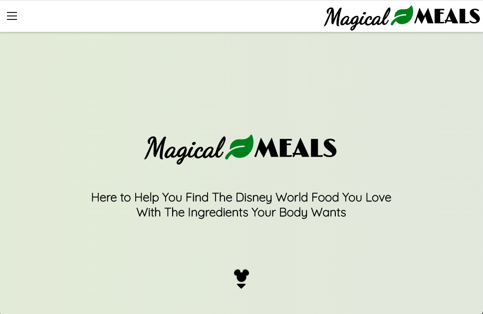

# Magical Meals

## Summary:

Magical Meals is a client-side React web app that lets users with dietary restrictions find meals based on park location at Walt Disney World. It was built to use an API, which can be viewed [here](https://github.com/CaitlinGreer/magical-meals-api.git). 

## Technology:

Magical Meals was made using a server-side program that can be found here:
* [Magical-Meals-Api](https://github.com/CaitlinGreer/magical-meals-api.git)

Details:
* React
* CSS
* PostgreSQL
* Node.js
* Express

## Check Out the Live Version:

[Magical Meals](https://magical-meals.vercel.app/)

## Screenshots

### Home Page

### Find A Meal Page

### Meal Results

### Contact Page

### Contact Form

